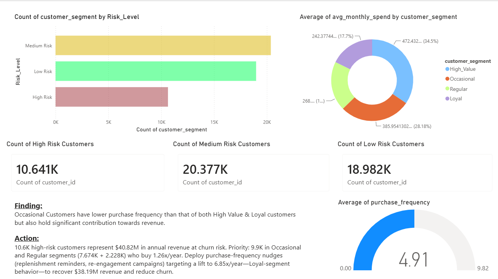

### Customer Churn Segmentation ###

Business Problem
An online retailer wanted to identify which customer segments were at highest churn risk and determine the most cost-effective lever to improve retention.

Data
Source: 50,000 customers from online retail transaction data (Kaggle datasets)
What you had: Purchase frequency, tenure (months active), monthly spend, customer segment (pre-labeled by the business)
What you didn't: Seasonal patterns, marketing channel attribution, demographic data beyond income
Limitation: Single dataset meant segmentation relied entirely on purchase frequency as the differentiator—no way to validate against external churn signals

Approach
Tested which customer attributes best predicted churn risk (frequency, time spent, spend, discounts, returns, support interactions). Found that purchase frequency alone was the strongest signal. Segmented customers by Risk Level (< 2x/year = High Risk) and mapped each segment's revenue contribution and behavioral patterns.

Key Insights
10.6K high-risk customers (those buying < 2x/year) represent $40.82M in annual revenue at churn risk
Occasional and Regular segments dominate this group (9.9K combined) but buy only 1.26x/year vs. 6.85x/year for Loyal customers
Occasional customers alone contribute $32.13M despite low frequency—second-largest revenue contributor after High Value
Frequency matters more than spend: A customer buying 7x/year for $240/month (Loyal) is more valuable than one buying 3x/year for $385/month (Occasional)
Medium-risk customers (20.3K) form the largest group—opportunity to nudge them upward before they slip to high-risk

Recommendation
Deploy campaigns targeting the 9.9K high-risk Occasional and Regular customers, with the goal of lifting them from 1.26x/year to 6.85x/year (Loyal benchmark). Focus on low friction, timing-based triggers: replenishment reminders (based on previous purchase intervals), re-engagement email campaigns, and post-purchase win-back prompts. This approach requires no new product or pricing changes—just better timing and messaging.

Tools Used
Power BI (DAX formula for Risk Level segmentation, cross filtered visualizations)

What You'd Do With More Data
Seasonal/channel data: 
Could identify whether low frequency is due to seasonality or permanent behavior, and tailor campaigns accordingly
Campaign history: 
Could test which re-engagement mechanics actually work and measure lift
Churn labels: 
Could validate that low frequency actually predicts churn
